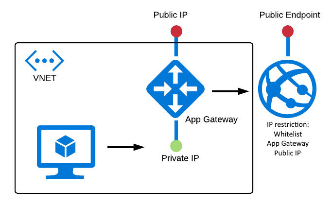

# Private Web App
## Introduction
In certain situations you want to deploy a Web App that is shielded off from the internet and only accessible from resources inside a designated Virtual Network. For example; a VM needs access to an API hosted as a Web App, but internet traffic should not have access.

This is not possible using out-of-the-box technologies such as [VNET Integration](https://docs.microsoft.com/en-us/azure/app-service/web-sites-integrate-with-vnet), since that only works one-way: The App Service can reach into the VNET but resources in the VNET do not get a route to the App Service. 

One option is to use an [App Service Environment](https://docs.microsoft.com/en-us/azure/app-service/environment/intro). This is a powerful offering that gives full network isolation and is essentially a single-tenant PaaS environment. While giving large benefits over regular App Services, the latter are a lot more affordable.

So what we want to do here is shield off the outside world effectively, by disabling routing to public end points. Enter: **The Private Web App**.

## The Private Web App
In all honesty, this solution is a bit of a 'hack' because it makes use of routing characteristics of the [Application Gateway](https://docs.microsoft.com/en-us/azure/application-gateway/application-gateway-introduction). These characteristics may not stand the test of time, so please *do not rely on this architecture for your production environments*.

Essentially we are going to set up:
- a regular App Service; without fancy VNET integration
- an App Gateway with both a public and a private IP
- routing solely from that private IP to the App Service
- finally whitelisting that public IP on the App Service

This leads to the App Service being only accessible from the *private* ip address. Traffic flowing from the VNET to the App Service is now 'translated' to the public IP address (this is the funky bit) and hence allowed access. And since there is no route from the public IP directly to the App Service; outside access is now blocked off.

To put this into a diagram:

The VM is deployed purely to prove that indeed the site is reachable from within the VNET on the Gateway's private IP address, in this case 10.0.0.12:

whereas public access is barred by the IP restrictions on the Web App:

Neither the App Service endpoint nor the App Gateway public endpoint can reach the Web App.

## PowerShell script
The supplied PowerShell script deploys all the resources pictured in the above diagram. As said, the VM is also deployed, but this is only for demonstration purposes.

If you have any questions or comments, please feel free to reach out!